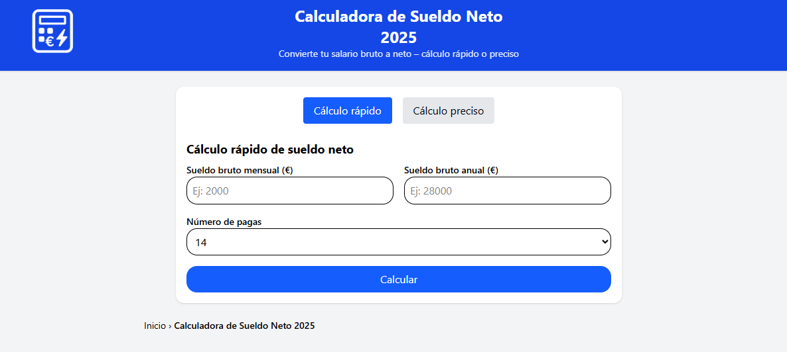

# 📊 Calculadora Sueldo Neto

[](https://calculadora-sueldo-neto.es)
[](LICENSE)

**Calculadora Sueldo Neto** es una herramienta online gratuita que permite convertir el salario bruto en neto en España de forma rápida y precisa.  
Incluye las últimas tablas de **IRPF**, cotizaciones a la **Seguridad Social** y deducciones personales y familiares, adaptadas a cada comunidad autónoma.

👉 **Prueba la calculadora aquí:** [https://calculadora-sueldo-neto.es](https://calculadora-sueldo-neto.es)

---

## 🚀 Características
- Cálculo rápido y preciso del sueldo neto  
- Compatible con todas las comunidades autónomas  
- Simulación de hijos, cónyuge e incapacidad  
- Comparación de contratos y pagas extras  
- Versión rápida y versión detallada  

---

## 📦 Instalación local (para desarrolladores)
Clona el repositorio y abre el proyecto en tu navegador:

```bash
git clone https://github.com/TU-USUARIO/calculadora-sueldo-neto.git
cd calculadora-sueldo-neto
open index.html
```

## 📸 Captura



## 🛠️ Tecnologías utilizadas
HTML5 + Tailwind CSS

JavaScript (vanilla)

GitHub Pages (para demo opcional)

## 📈 Estado del proyecto
✅ Versión inicial en producción
🔄 Mejoras futuras: optimización SEO, soporte internacional

## 📄 Licencia
Este proyecto está bajo licencia MIT.
Libre para usar, modificar y compartir con atribución.
